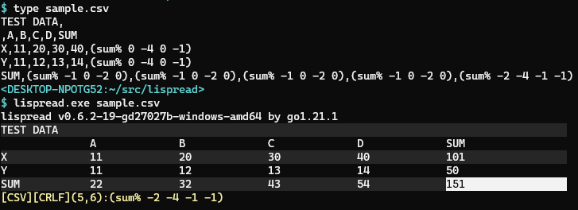

Lispread - Lisp/Spread
======================

This is the fork of [csview] that
supports [gmnlisp] code in the cell.

[csview]: https://github.com/hymkor/csview
[gmnlisp]: https://github.com/hymkor/gmnlisp

Functions
---------

- `(rc  R C)` ... refer the cell value at R:C as string
- `(rc% R C)` ... refer the cell value at R:C as integer
- `(rc! R C)` ... refer the cell value at R:C as float
- `(sum% R1 C1 R2 C2)` ... the sum of the cells between R1:C1 and R2:C2 as integer
- `(sum! R1 C1 R2 C2)` ... the sum of the cells between R1:C1 and R2:C2 as float

`R:C` is the relative address (row and column number) from the current cell.
